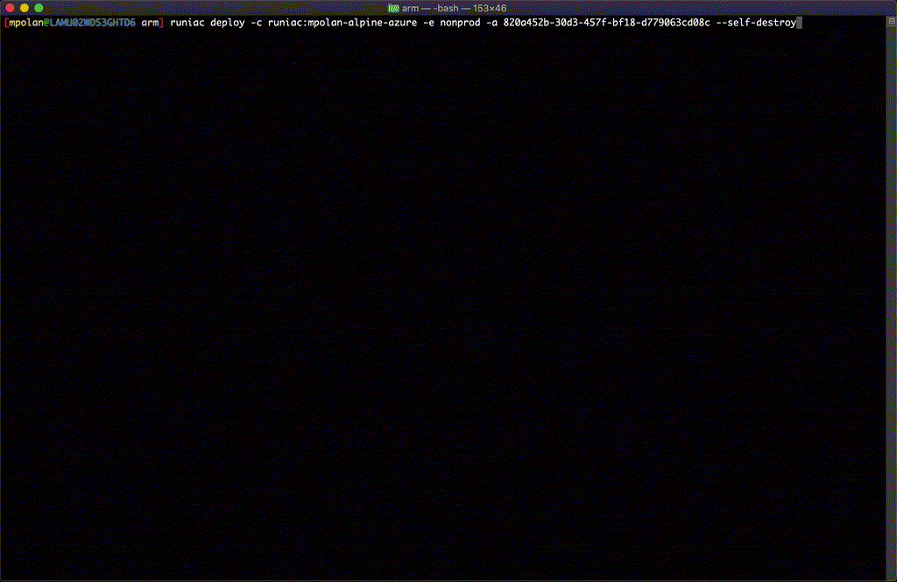

# runiac - Run IaC Anywhere With Ease

[Documentation](https://runiac.io/docs)

[](https://GitHub.com/optum/runiac/graphs/commit-activity)

[](https://GitHub.com/optum/runiac/releases/)

[comment]: <> (<a href="https://cla-assistant.io/Optum/runiac"></a>)

[](http://golang.org)


---

A tool for running infrastructure as code (e.g. Terraform) anywhere with ease.

- Ability to change and test infrastructure changes locally with a production like environment
- Ability to make infrastructure changes without making pipeline changes
- Quality developer experience
- Container-based, execute anywhere and on any CI/CD system
- Multi-Region deployments built-in
- Handling groups of regions for data privacy regulations
- Enabling "terraservices"
- Keeping Your Pipelines Simple
- Plugin-based

> NOTE: README documentation is out of date and will be removed soon. Please see [runiac.io](https://runiac.io) for latest docs

runiac's primary goal is enabling easy, meaningful local development that mimics a production deployment.

[comment]: <> (runiac is meant to be run as an image. We do **not** recommend running the `runiac` executor binary in another image, as it might not work.)

We'd love to hear from you! Submit github issues for questions, issues or feedback.

<!-- START doctoc generated TOC please keep comment here to allow auto update -->
<!-- DON'T EDIT THIS SECTION, INSTEAD RE-RUN doctoc TO UPDATE -->

**Table of Contents** _generated with [DocToc](https://github.com/thlorenz/doctoc)_

- [How does runiac work?](#how-does-runiac-work)
- [Demo](#demo)
- [Install](#install)
- [Tutorial](#tutorial)
- [Using runiac](#using-runiac)
  - [Inputs](#inputs)
    - [Choosing which steps to execute](#choosing-which-steps-to-execute)
      - [Environment Variables](#environment-variables)
      - [Configuration Files](#configuration-files)
    - [Versioning](#versioning)
  - [Provider Plugin Caching](#provider-plugin-caching)
- [Runners](#runners)
  - [Terraform](#terraform)
    - [Using Previous Step Output Variables](#using-previous-step-output-variables)
      - [Regional Variables](#regional-variables)
    - [Common Input Variables](#common-input-variables)
    - [Tests](#tests)
    - [Test Convention Requirements](#test-convention-requirements)
  - [Conventions and Supported Configurations](#conventions-and-supported-configurations)
    - [Backend](#backend)
      - [Type](#type)
      - [S3](#s3)
      - [GCS](#gcs)
    - [Deployment Ring Specific Configurations](#deployment-ring-specific-configurations)
      - [Count](#count)
    - [Override Files](#override-files)
- [Contributing](#contributing)
  - [Running Locally](#running-locally)

<!-- END doctoc generated TOC please keep comment here to allow auto update -->

## How does runiac work?

runiac's primary goal is to enable developers to spend more time iterating on valuable infrastructure changes rather than pipeline or glue code.  
It enables this by following the `smart endpoints, dumb pipelines`, `portability`, and `fun` principles defined at `doeac`.

- Infrastructure changes do not require pipeline changes
- Ability to change and test infrastructure changes locally with a production like environment

What expo did for react native development, runiac does for terraform.
What webpack did for react development, runiac does for terraform.

- Directory layout
- Steps
  - Primary deployment type
  - Regional
- Config
  - Primary Regions
  - Regional Regions
  - Project
  - Environment
  - Account
  - Namespace
  - `--local`
- Tracks

## Demo

See runiac in action!



## Install

**homebrew tap**:

```bash
brew install optum/tap/runiac
```

**manually**:

Download the pre-compiled binaries from the [releases](https://github.com/Optum/runiac/releases) page and copy to the desired location.

## Tutorial

For more detailed examples of runiac, be sure to check out the [examples](examples/) directory!

## Using runiac

To use runiac to deploy your infrastructure as code, you will need:

1. `Docker` installed locally
2. `runiac` installed locally

### Inputs

Execute `runiac deploy -h`

##### Configuration Files

A configuration file can exist in either a track's or step's directory.

- `runiac.yaml`

```yaml
enabled: <true|false> # This determines whether the step will be executed
execute_when: # This will conduct a runtime evaluation on whether the step should be executed
  region_in: # By matching the `var.region` input variable
    - "region-1"
```

#### Versioning

The most flexible way to specify a version string for your deployment artifacts is to use the `VERSION` environment variable. You
can source your version string however you wish with this approach.

Otherwise, you can create a `version.json` file at the root of the directory structure, with a `version` element:

```json
{
  "version": "v0.0.1"
}
```

If both are present, `version.json` takes precedence over the `VERSION` environment variable.

### Provider Plugin Caching

runiac uses [provider plugin caching](https://www.terraform.io/docs/commands/cli-config.html#provider-plugin-cache). Projects that use runiac are responsible for creating the directories that are used for provider caching and also creating their own [.terraformrc](https://www.terraform.io/docs/commands/cli-config.html) file. Please note that with the upgrade to Terraform `v0.13`, projects will need to update their filesystem layout for local copies of providers as stated [here](https://www.terraform.io/upgrade-guides/0-13.html#new-filesystem-layout-for-local-copies-of-providers).

#### Tests

Tests within a step will automatically be executed after a successful deployment.

#### Test Convention Requirements

- Need to be defined in a `tests` directory within the _step_'s directory.
- Need to be golang tests OR compiled to an executable named `tests.test`
  - If using golang tests, runiac Build Container will compile the tests to an executable automatically as part of container build process
  - Golang tests are the recommendation (ie. Terratest).
- The tests directory will receive the terraform outputs of the step as `TF_VAR` environment variables

For example in the following source code directory:

```bash
tracks/iamsso/step1_aws/
├── tests
│   └── step_test.go
├── backend.tf
├── outputs.tf
├── providers.tf
├── read_only_role.tf
├── shared.tf
├── variables.tf
└── versions.tf
```

As part of container build, runiac will compile the golang test code into:

```bash
tracks/iamsso/step1_aws/
├── tests
│   └── tests.test
├── backend.tf
├── outputs.tf
├── providers.tf
├── read_only_role.tf
├── shared.tf
├── variables.tf
└── versions.tf
```

runiac will then execute `tests.test` after a successful step deployment.

### Conventions and Supported Configurations

#### Backend

##### [Type](https://www.terraform.io/docs/backends/types/index.html)

By convention the backend type will be automatically configured.

Supported Types:

- S3
- AzureRM
- GCS
- Local

If defining local, terraform will be executed "fresh" each time. This works very well when the step is only executing scripts/binaries through `local-exec`.

While you normally cannot use variable interpolation in typical Terraform backend configurations, runiac allows you some more flexibility
in this area. Depending on which backend provider you are intending to use, the sections below detail which variables can be used in your
configuration. These variables will be interpolated by runiac itself prior to executing Terraform.

##### S3

Supported variables for dynamic [`key`](https://www.terraform.io/docs/backends/types/s3.html#key), [`bucket`](https://www.terraform.io/docs/backends/types/s3.html#role_arn) or [`role_arn`](https://www.terraform.io/docs/backends/types/s3.html#bucket) configuration:

- `${var.runiac_region_deploy_type}`: **required** in `key`
- `${var.region}`: **required** in `key`
- `${var.runiac_step}`
- `${var.core_account_ids_map}`
- `${var.runiac_target_account_id}`
- `${var.runiac_deployment_ring}`
- `${var.environment}`
- `${local.namespace-}` (temporary backwards compatibility variable)

Example Usage:

```hcl-terraform
terraform {
  backend "s3" {
    key      = "${var.runiac_target_account_id}/${local.namespace-}${var.runiac_step}/${var.runiac_region_deploy_type}-${var.region}.tfstate"
    bucket   = "product-tfstate-${var.core_account_ids_map.runiac_deploy}"
    role_arn = "arn:aws:iam::${var.core_account_ids_map.runiac_deploy}:role/StateRole"
    acl      = "bucket-owner-full-control"
    region   = "us-east-1"
    encrypt  = true
  }
}
```

##### GCS

Supported variables for dynamic [`bucket and/or prefix`](https://www.terraform.io/docs/backends/types/gcs.html#configuration-variables) configuration:

- `${var.gaia_region_deploy_type}`
- `${var.region}`
- `${var.gaia_step}`
- `${var.core_account_ids_map}`
- `${var.gaia_target_account_id}`
- `${var.gaia_deployment_ring}`
- `${var.environment}`
- `${local.namespace-}` (temporary backwards compatibility variable)

Example Usage:

```hcl-terraform
terraform {
  backend "gcs" {
    bucket  = "df-${var.environment}-tfstate"
    prefix  = "infra/${var.gaia_deployment_ring}/${var.gaia_region_deploy_type}/${var.region}/${local.namespace-}infra.tfstate"
  }
}
```

#### Deployment Ring Specific Configurations

##### Count

The most common and terraform friendly to implement deployment specific configuration is via `count` and simple `if` statements in the terraform code based on the passed in `var.runiac_deployment_ring` value.

#### Override Files

The alternative option is using terraform's [override feature](https://www.terraform.io/docs/configuration/override.html). runiac handles this based on the `override` directory within a step.

The supported override files are below:

- `override.tf` - file will be added for all deployment rings and deployments, including Self-Destroy.
- `ring_*ring-name*_override.tf` - file will be added for the specified deployment ring and deployments, including Self-Destroy.
- `destroy_override.tf` - file will be added for all deployment rings and Self-Destroy deployments.
- `destroy_ring_*ring-name*_override.tf` - file will be added for the specified deployment ring and Self-Destroy deployments.

---

For example, in the following step when deploying to:

- `local` deployment ring: the `ring_local_override.tf` file will be added to the executed terraform
- `prod` deployment ring: the `ring_prod_override.tf` file will be added to the executed terraform

```bash
tracks/iamsso/step1_aws/
├── override
│   └── ring_local_override.tf
│   └── ring_prod_override.tf
├── backend.tf
├── outputs.tf
├── providers.tf
├── read_only_role.tf
├── shared.tf
├── variables.tf
└── versions.tf
```

For example, in `main.tf`:

```hcl-terraform
# super important resource that cannot be deleted
resource "aws_s3_bucket" "centralized_logging_master_bucket" {
  bucket        = "log-compliance-data"

  lifecycle {
    prevent_destroy = true
  }
}
```

And then for ephemeral environments (e.g. local development), `ring_local_override.tf`:

```hcl-terraform
# super important resource that can be deleted in local deployment ring
resource "aws_s3_bucket" "centralized_logging_master_bucket" {
  lifecycle {
    prevent_destroy = false
  }
}
```

This has the benefit of not introducing the subtle complexities of "toggling" between two different resources with `count`

**NOTE**: Terraform recommends using this feature sparingly as it is not noticeable the value is overridden in the main terraform files.
A common use case for this feature is controlling terraform `lifecycle` parameters for ephemeral environments while keeping the main terraform files defined for production.

## Contributing

Please read [CONTRIBUTING.md](./CONTRIBUTING.md) first.

### Running Locally

runiac is only executed locally with unit tests. To execute runiac child projects locally, one would need to build this container first.

Docker Build:

```bash
$ DOCKER_BUILDKIT=1 docker build -t runiac .
```

We recommend adding an alias to install the cli locally:

`alias runiacdev='(cd <LOCAL_PROJECT_LOCATION>/cmd/cli && go build -o $GOPATH/bin/runiacdev) && runiacdev'`

This allows one to use the the `examples` for iterating on runiac changes.

```bash
$ cd examples/terraform-gcp-hello-world
$ runiacdev -a <YOUR_GCP_PROJECT_ID> -e nonprod --local
```
