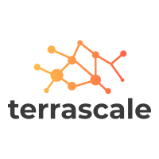

# Terrascale



---

An opinionated framework and tool for scaling terraform with ease.

- Quality developer experience
- Container-based, execute anywhere or use any CI/CD system
- Multi-Region deployments built-in
- Integration testing built-in
- Handling groups of regions for data privacy regulations
- Handling "terraservices"

---

## Quick Start

### Inputs

Configuration for executing Terrascale is done through environment variables. For a list of options of see the code [here](pkg/config/config.go)

#### Choosing which steps to execute

##### Environment Variables

- `GAIA_STEP_WHITELIST`

##### Configuration File

A configuration file can exist in either a track's or step's directory.

- `gaia.yaml`

```yaml
enabled: <true|false> # This determines whether the step will be executed
execute_when: # This will conduct a runtime evaluation on whether the step should be executed
  region_in: # By matching the `var.region` input variable
  - "region-1" 
```

## Overview

### Tracks

1. All _Tracks_ will be executed in parallel at the same time

- By definition **tracks do not have depedencies on each other**. If they do, treat them as one track with multiple steps

2. For a track to be executed at least one _Step_ has to be defined within it

### Steps

- All _Steps_ need to be defined within a _Track_
- _Steps_ follow a folder naming convention of `step{progressionLevel}_{stepName}`
  - A _Step_'s _Progression Level_ orders the execution of steps.
- All steps receive a common set of input variables (see below)
- All steps receive the output variables of the steps in the progression level ahead of them.
  a. For example, output variables of `step1` will be sent into `step2`, output variables of `step1` and `step2` will be passed into `step3`, so on and so forth
- Steps will automatically execute tests after a successful deployment, these are primarily used for smoke testing (see below)
- All steps have their own statefile.
- Steps have two types of deployment, `Primary` and `Regional`.

#### Step Execution Examples

In the following _Track_ directories:

##### Concurrent Steps

```bash
stages/customer/tracks/iamsso
├── step1_aws
└── step1_onprem_adgroups
```

`step1_aws` and `step1_onprem_adgroups` will be executed at concurrently at the same time.

##### Sequential Steps

```bash
stages/customer/tracks/network
├── step1_vpc
└── step2_egress_proxy
```

`step1_vpc` will be executed first and after completion `step2_egress_proxy` will be executed.

##### Concurrent and Sequential Steps

```bash
stages/customer/tracks/network
├── step1_vpc
├── step1_aws
└── step2_cool_step
└── step2_special_step
└── step3_something_awesome
```

1. `step1_vpc` and `step1_aws` will be executed first concurrently at the same time.
2. After completion of both `step2_cool_step` and `step2_special_step` will be executed concurrently at the same time.
   a. The output variables of both `step1`'s will be passed into `step2` steps
3. After completion of both `step2`'s, `step3_something_awesome` will be executed.
   a. The output variables of all `step1` and `step2`'s will be passed into `step3` steps

#### Step Deployment Types

Step deployment types facilitate multi-region deployments. Gaia will first execute every primary step deployment type in a track. Assuming successful execution, it will then proceed through each step regional deployment type concurrently across each region.

##### Primary

Primary deployments represent all terraform in the top level directory of the executing step. Currently the primary type is executed _once per region group_. For example, in the `us` region group, the primary code would only be executed in the primary region of the `us` region group, `us-east-1`.

```bash
stages/customer/tracks/network
├── step1_vpc
├──--- *.tf
```

##### Regional

Regional deployments represent all terraform in the `/regional` directory of the executing step. This code will be executed concurrently `N` times based on `N` count of regions defined in `-e GAIA_TARGET_REGIONS` configuration.

```bash
stages/customer/tracks/network
├── step1_vpc
├──--- regional
├──--------*.tf
```

#### Using Previous Step Output Variables

By default, Gaia will pass in the output variables from previous steps into the current step.

For example, if `step1_s3_bucket` has a defined `outputs.tf`:

```hcl-terraform
output "producer_assume_role_arn" {
  description = "The name of the S3 Bucket (Purple Bucket) that will be the destination of all logs on the AWS account."
  value       = aws_iam_role.producer_lambda_role.arn
}
```

Then `step2_logging` can use it by declaring a variable as `{step_name}-{output_variable_name}`, for example:

```hcl-terraform
variable "s3_bucket-producer_assume_role_arn" {
  type        = string
  description = "Variable from step1_s3_bucket"
}
```

##### Regional Variables

When working in a regional context, additional passed variables are available from prior step's regional deployments.

> NOTE: Only output variables from primary and _same region_ regional deployments are available to regional deployments

To access previous step's regional output variables one can do so by adding `-regional-` after the step name of the variable, like the following:

```hcl-terraform
variable "s3_bucket-regional-producer_assume_role_arn" {
  type        = string
  description = "Variable from step1_s3_bucket"
}
```

#### Common Input Variables

```terraform
variable "region" {
  type        = string
  description = "The region for this Terraform run"
}

variable "namespace" {
  type        = string
  description = "The namespace for this Terraform run" # During PR, this value is set to `pr-{changeId}`, ie. pr-3
}

variable "environment" {
  type        = string
  description = "Designates the production level of the associated resource" # During PR, this value is set to `pr`
}

variable "app_version" {
  type        = string
  description = "Designates the specific version of the application deployment"
}

variable "creds_id" {
  type        = string
  description = "The version of the tagging strategy applied"
}

variable "account_id" {
  type        = string
  description = "ID of the Account being deployed to"
}

variable "account_owner_msid" {
  type        = string
  description = "MSID for the owner of the Account being deployed to"
}

variable "core_account_ids_map" {
  type        = map(string)
  description = "Mapping of the available core account ids, AWS: logging_final_destination, guard_duty_master, logging_bridge_aws, logging_bridge_azu"
}

### Optional Variables

# The initial use case for this variable is to know which account is the original target after overriding
# provider.assume_role.arn in terraform.
variable "gaia_target_account_id" {
  type        = string
  description = "The account id that the step function told the fargate task to deploy to"
}

variable "gaia_deployment_ring" {
  type = string
  description = "The deployment ring currently being executed in"
}

variable "gaia_stage" {
  type = string
  description = "The stage currently being executed in"
}

variable "gaia_track" {
  type = string
  description = "The track currently being executed in"
}

variable "gaia_step" {
  type = string
  description = "The step currently being executed in"
}

variable "gaia_region_deploy_type" {
  type = string
  description = "The step deployment type, either primary or regional"
}

variable "gaia_region_group" {
  type = string
  description = "The region group being deployed in, supported: 'us'"
}

variable "gaia_primary_region" {
  type = string
  description = "The primary region of the gaia_region_group"
}

variable "gaia_region_group_regions" {
  type = string
  description = "The list of regions within the gaia_region_group.  This list represents the regions that will be used to execute the `regional` directory within a step."
}
```

#### Tests

Tests within a step will automatically be executed after a successful deployment.

#### Test Convention Requirements

- Need to be defined in a `tests` directory within the _step_'s directory.
- Need to be golang tests OR compiled to an executable named `tests.test`
  - If using golang tests, Gaia Build Container will compile the tests to an executable automatically as part of container build process
  - Golang tests are the recommendation (ie. Terratest).
- The tests directory will receive the terraform outputs of the step as `TF_VAR` environment variables

For example in the following source code directory:

```bash
tracks/iamsso/step1_aws/
├── tests
│   └── step_test.go
├── backend.tf
├── outputs.tf
├── provider.tf
├── read_only_role.tf
├── shared.tf
├── variables.tf
└── versions.tf
```

As part of container build, Bedrock will compile the golang test code into:

```bash
tracks/iamsso/step1_aws/
├── tests
│   └── tests.test
├── backend.tf
├── outputs.tf
├── provider.tf
├── read_only_role.tf
├── shared.tf
├── variables.tf
└── versions.tf
```

Bedrock will then execute `tests.test` after a successful step deployment.

### Conventions and Supported Configurations

#### Backend

##### [Type](https://www.terraform.io/docs/backends/types/index.html)

By convention the backend type will be automatically configured.

Supported Types:

- Local
- S3

If defining local, the terraform will be executed "fresh" each time. This works very well when the step is only executing scripts/binaries through `local-exec`

##### [S3 Key](https://www.terraform.io/docs/backends/types/s3.html#key)

By convention the state file key will use the step name as state file key. If the `backend.key` parameter is set, Gaia will use this value. This helps provide backwards compatibility for existing terraform infrastructure moving to Gaia.
Gaia will also automatically prepend the `backend.key` value to be specific to the account. This is based on the `account_id` and `gaia_target_account_id` variables.

If `gaia_target_account_id` exists this will be used as the state account directory. If `gaia_target_account_id` does not exist (projects using `ByCount` execution model, ie. `launchpad_core_aws`) `account_id` will be used

Supported variables for dynamic `key` configuration:

- `${var.gaia_deployment_ring}`

See `TestGetBackendConfigWithGaiaTargetAccountID_ShouldHandleSettingCorrectAccountDirectory` in the [unit tests](pkg/steps/steps_test.go) for more information


##### [S3 RoleArn](https://www.terraform.io/docs/backends/types/s3.html#role_arn)

Supported variables for dynamic `role_arn` configuration:

- `${var.core_account_ids_map}`
- `${var.gaia_target_account_id}`
- `${var.gaia_deployment_ring}`

#### Provider (AWS)

At this time, providers **must** be defined in a `providers.tf` file for this configuration to work

##### [AssumeRole](https://www.terraform.io/docs/providers/aws/index.html#assume-role)

By convention Gaia will assume role into the `OrganizationAccountAccessRole` of the `ACCOUNT_ID` environment variable prior to executing any steps. However, sometimes there is value in explicitly defining terraform infrastructure for multiple accounts in the same repository, for example a subset of "Core" accounts all other accounts share. To support this, Bedrock container will use the `provider.assume_role.role_arn` value in the step's `provider.tf` where one can explicitly set which account the terraform will be executed in via the assume role arn.

#### Provider (Azurerm)

At this time, providers **must** be defined in a `providers.tf` file for this configuration to work

##### Targeting a specific Azure subscription using [subscription_id](https://www.terraform.io/docs/providers/azurerm/index.html#subscription_id)

To mirror the `assume_role` functionality for AWS core deployments in Gaia, Azure supports deploying to Azure core accounts using the `subscription_id` field in the provider. For example:

```hcl
provider "azurerm" {
  version         = "1.35.0"
  subscription_id = var.core_account_ids_map.tenant_core_azu
}
```

When using this functionality, you can only specifiy an account in the `core_account_ids_map` Terraform variable. If this value is not specified, Gaia will deploy to the account that was specified by the `ARM_SUBSCRIPTION_ID` environment variable.

###### Supported parameters

The `gaia_target_account_id` and any key available in the `core_account_ids_map` input variable can be used in the `provider.assume_role.role_arn` value. For example, to deploy infrastructure only the AWS Bridge Logging accounts the configuration would minimally need to include:

```hcl
provider "aws" {
  assume_role = {
    role_arn     = "arn:aws:iam::${var.core_account_ids_map.logging_bridge_aws}:role/OrganizationAccountAccessRole"
  }
 }
```

In this example the terraform `creds_id` and `account_id` input variables will match the values for `logging_bridge_aws`

> NOTE: Only using the `OrganizationAccountAccessRole` role is supported

#### Working with Secrets

Secrets within Gaia should be stored within AWS SSM Parameter Store as encrypted parameters. Gaia utilizes a naming hierarchy for scoping the secrets.

This hierarchy goes as `/bedrock/delivery/{csp}/{stage}/{track}/{step}/{ring}/param-{parameter}`

Parameters defined at a more granular level (ie. step over csp) will take precedent.

See the appropriate unit tests for how this works [here](pkg/params/params_test.go).

> NOTE: These parameters must be defined in the account Bedrock delivery framework executes in.

#### Deployment Ring Specific Configurations

##### Count

The most common and terraform friendly to implement deployment specific configuration is via `count` and simple `if` statements in the terraform code based on the passed in `var.gaia_deployment_ring` value.

#### Override Files

The alternative option is using terraform's [override feature](https://www.terraform.io/docs/configuration/override.html).  Gaia handles this based on the `override` directory within a step.

For example, in the following step when deploying to:

- `local` deployment ring: the `ring_local_override.tf` file will be added to the executed terraform
- `prod` deployment ring: the `ring_prod_override.tf` file will be added to the executed terraform

```bash
tracks/iamsso/step1_aws/
├── override
│   └── ring_local_override.tf
│   └── ring_prod_override.tf
├── backend.tf
├── outputs.tf
├── provider.tf
├── read_only_role.tf
├── shared.tf
├── variables.tf
└── versions.tf
```

For example, in `main.tf`:

```hcl-terraform
# super important resource that cannot be deleted
resource "aws_s3_bucket" "centralized_logging_master_bucket" {
  bucket        = "log-compliance-data"
  
  lifecycle {
    prevent_destroy = true
  }
}
```  

And then for ephemeral environments (e.g. local development), `ring_local_override.tf`:

```hcl-terraform
# super important resource that can be deleted in local deployment ring
resource "aws_s3_bucket" "centralized_logging_master_bucket" {
  lifecycle {
    prevent_destroy = false
  }
}
```  

This has the benefit of not introducing the subtle complexities of "toggling" between two different resources with `count`

**NOTE**: Terraform recommends using this feature sparingly as it is not noticable the value is overridden in the main terraform files.
A common use case for this feature is controlling terraform `lifecycle` parameters for ephemeral environments while keeping the main terraform files defined for production.

## Contributing

### Running Locally

Terrascale is only executed locally via it's unit tests. To execute Gaia child projects locally, one would need to build this container first.

```bash
$ DOCKER_BUILDKIT=1 docker build -t terrascale .
# Now one can build the child containers (launchpad_core_aws, bedrock_aws, etc)
```

> NOTE: Optum Healthcare Public Cloud team, further local instructions are available [here](https://new-wiki.optum.com/display/COMCLDDLV/Gaia%3A+Local+Configuration)
