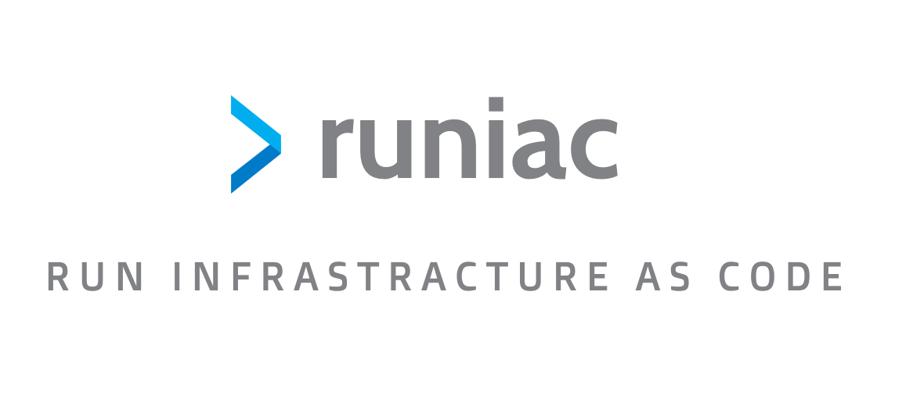

# runiac - Run IaC Code With Ease, Anywhere



---

An opinionated tool for running infrastructure as code (e.g. Terraform) with ease.

- Quality developer experience
- Container-based, execute anywhere and on any CI/CD system
- Multi-Region deployments built-in
- Handling groups of regions for data privacy regulations
- Enabling "terraservices"
- Keeping Your Pipelines Simple
- Plugin-based

[comment]: <> (runiac is meant to be run as an image.  We do **not** recommend running the `runiac` executor binary in another image, as it might not work.)

We'd love to hear from you!  Submit github issues for questions, issues or feedback.

<!-- START doctoc generated TOC please keep comment here to allow auto update -->
<!-- DON'T EDIT THIS SECTION, INSTEAD RE-RUN doctoc TO UPDATE -->
**Table of Contents**  *generated with [DocToc](https://github.com/thlorenz/doctoc)*

- [How does runiac work?](#how-does-runiac-work)
- [Demo](#demo)
- [Tutorial](#tutorial)
- [Terminology](#terminology)
  - [Steps](#steps)
    - [Step Execution Examples](#step-execution-examples)
      - [Concurrent Steps](#concurrent-steps)
      - [Sequential Steps](#sequential-steps)
      - [Concurrent and Sequential Steps](#concurrent-and-sequential-steps)
    - [Step Deployment Types](#step-deployment-types)
      - [Primary](#primary)
      - [Regional](#regional)
  - [Tracks](#tracks)
    - [Default Track](#default-track)
    - [Pre-track](#pre-track)
- [Using runiac](#using-runiac)
  - [Inputs](#inputs)
    - [Choosing which steps to execute](#choosing-which-steps-to-execute)
      - [Environment Variables](#environment-variables)
      - [Configuration Files](#configuration-files)
    - [Versioning](#versioning)
  - [Provider Plugin Caching](#provider-plugin-caching)
- [Runners](#runners)
  - [Terraform](#terraform)
    - [Using Previous Step Output Variables](#using-previous-step-output-variables)
      - [Regional Variables](#regional-variables)
    - [Common Input Variables](#common-input-variables)
    - [Tests](#tests)
    - [Test Convention Requirements](#test-convention-requirements)
  - [Conventions and Supported Configurations](#conventions-and-supported-configurations)
    - [Backend](#backend)
      - [Type](#type)
      - [S3](#s3)
      - [GCS](#gcs)
    - [Provider (AWS)](#provider-aws)
      - [AssumeRole](#assumerole)
    - [Provider (Azurerm)](#provider-azurerm)
      - [Targeting a specific Azure subscription using subscription_id](#targeting-a-specific-azure-subscription-using-subscription_id)
        - [Supported parameters](#supported-parameters)
    - [Working with Secrets](#working-with-secrets)
    - [Deployment Ring Specific Configurations](#deployment-ring-specific-configurations)
      - [Count](#count)
    - [Override Files](#override-files)
- [Contributing](#contributing)
  - [Running Locally](#running-locally)

<!-- END doctoc generated TOC please keep comment here to allow auto update -->

## How does runiac work?

runiac's primary goal is to enable developers to spend more time iterating on valuable infrastructure changes rather than pipeline or glue code.  
It enables this by following the `smart endpoints, dumb pipelines`, `portability`, and `fun` principles defined at `doeac`.  

- Infrastructure changes do not require pipeline changes
- Ability to change and test infrastructure changes locally with a production like environment

What expo did for react native development, runiac does for terraform.
What webpack did for react development, runiac does for terraform.

- Directory layout
- Steps
    - Primary deployment type
    - Regional
- Config
    - Primary Regions
    - Regional Regions
    - Project
    - Environment
    - Account
    - Namespace
    - `--local`
- Tracks

## Demo

- Record Gif Here of running `runiac`

## Tutorial

For more detailed examples of runiac, be sure to check out the [examples](examples/) directory!

## Terminology

### Steps

- _Steps_ follow a folder naming convention of `step{progressionLevel}_{stepName}`
    - A Step's _Progression Level_ identifies the ordering of execution.
- All steps receive a common set of input variables (see below)
- All steps receive the output variables of the steps in the progression level ahead of them.
  - For example:
    - output variables of `step1` will be sent into `step2`
    - output variables of `step1` and `step2` will be passed into `step3`
    - so on, so forth
- Steps will automatically execute tests after a successful deployment, these are primarily used for smoke testing (see below)
- Steps have two types of deployment, `Primary` and `Regional`.

#### Step Execution Examples

In the following _Track_ directories:

##### Concurrent Steps

```bash
tracks/iamsso
├── step1_aws
└── step1_onprem_adgroups
```

`step1_aws` and `step1_onprem_adgroups` will be executed at concurrently at the same time.

##### Sequential Steps

```bash
tracks/network
├── step1_vpc
└── step2_egress_proxy
```

`step1_vpc` will be executed first and after completion `step2_egress_proxy` will be executed.

##### Concurrent and Sequential Steps

```bash
tracks/network
├── step1_vpc
├── step1_aws
└── step2_cool_step
└── step2_special_step
└── step3_something_awesome
```

1. `step1_vpc` and `step1_aws` will be executed first concurrently at the same time.
2. After completion of both `step2_cool_step` and `step2_special_step` will be executed concurrently at the same time.
   a. The output variables of both `step1`'s will be passed into `step2` steps
3. After completion of both `step2`'s, `step3_something_awesome` will be executed.
   a. The output variables of all `step1` and `step2`'s will be passed into `step3` steps

#### Step Deployment Types

Step deployment types facilitate multi-region deployments. runiac will first execute every primary step deployment type in a track.
If the primary region deployment is successful, runiac will then run each step's regional deployment type (`regional`) concurrently across each region defined in `regional_regions`.

##### Primary

Primary deployments represent all iac in the top level directory of the executing step.
Currently, the primary deployment type is executed _once per region group_. 
For example, in the `us` region group, the primary code would only be executed in the primary region of the `us` region group, `us-east-1`.

```bash
tracks/network
├── step1_vpc
├──--- *.tf
```

##### Regional

Regional deployments represent iac in the `regional` directory of the executing step. This code will be executed concurrently `N` times based on `N` count of regions defined in `regional_regions` configuration.

```bash
tracks/network
├── step1_vpc
├──--- regional
├──--------*.tf
```

### Tracks

1. All _Tracks_ beside the [pre-track](#pre-track) will be executed in parallel

- By definition **tracks do not have depedencies on each other**. If they do, treat them as one track with multiple steps

2. For a track to be executed, at least one _Step_ has to be defined within it

#### Default Track

For projects that are relatively straightforward and don't require multiple tracks, you do not need to use tracks in your folder heiarachy. 
The benefit of this approach is a simpler directory hierarchy, and you still have the possibility to scale out with
multiple tracks down the road.

Be aware that with this simpler approach, you cannot use pre-tracks (see below).

A sample structure from the root directory of your project might look like this:

```bash
step1_sample/
step1_another_one/
runiac.yml
```

To whitelist steps for execution when using a default track, use the track name `default` in your `step_whitelist`:

```bash
RUNIAC_STEP_WHITELIST="#runiac#default#sample,#runiac#default#another_one"
```

#### Pre-track

A pre-track is a track that runs before **all** other tracks. After this track completes, the remaining tracks are executed in parallel. If the pre-track execution fails, no other tracks will be attempted. To create a pre-track, create a directory called `_pretrack` in the `tracks` directory.

## Using runiac

To use runiac to deploy your infrastructure as code, you will need:

1. `Docker` installed locally
2. `runiac` installed locally

### Inputs

Configuration for executing runiac is done through environment variables. For a list of options, see the code [here](pkg/config/config.go).

#### Choosing which steps to execute

By default, steps will not be executed unless they are explicitly configured to do so.

##### Environment Variables

- `runiac_STEP_WHITELIST`: list of step names to include in execution

When providing a list of steps to execute using the `runiac_STEP_WHITELIST` environment variable, the general syntax is as follows:

```
#PROJECT[#TRACK]#STEP_NAME,...
```

Where:
* `PROJECT` is the value of the `runiac_PROJECT` environment variable (default to `runiac` is not specified)
* `[TRACK]` is the name of the track the step is located under (unless using the default track)
* `STEP_NAME`: is the name of the step, without the leading `stepX_` prefix

For example, given the following runiac directory setup:

```bash
tracks/
├── infra/
├──── step1_sample/
├── shared
├──── step1_sample/
├──── step1_another_one/
```

If you wanted all three steps to be executed, you would specify them as such:

```bash
runiac_STEP_WHITELIST="#runiac#infra#sample,#runiac#shared#sample,#runiac#shared#another_one"
```

##### Configuration Files

A configuration file can exist in either a track's or step's directory.

- `runiac.yaml`

```yaml
enabled: <true|false> # This determines whether the step will be executed
execute_when: # This will conduct a runtime evaluation on whether the step should be executed
  region_in: # By matching the `var.region` input variable
    - "region-1"
```

#### Versioning

The most flexible way to specify a version string for your deployment artifacts is to use the `VERSION` environment variable. You
can source your version string however you wish with this approach.

Otherwise, you can create a `version.json` file at the root of the directory structure, with a `version` element:
```json
{
  "version": "v0.0.1"
}
```

If both are present, `version.json` takes precedence over the `VERSION` environment variable.

### Provider Plugin Caching

runiac uses [provider plugin caching](https://www.terraform.io/docs/commands/cli-config.html#provider-plugin-cache). Projects that use runiac are responsible for creating the directories that are used for provider caching and also creating their own [.terraformrc](https://www.terraform.io/docs/commands/cli-config.html) file. Please note that with the upgrade to Terraform `v0.13`, projects will need to update their filesystem layout for local copies of providers as stated [here](https://www.terraform.io/upgrade-guides/0-13.html#new-filesystem-layout-for-local-copies-of-providers).

## Runners

### Terraform

#### Using Previous Step Output Variables

By default, runiac will pass in the output variables from previous steps into the current step.

For example, if `step1_s3_bucket` has a defined `outputs.tf`:

```hcl-terraform
output "producer_assume_role_arn" {
  description = "The name of the S3 Bucket (Purple Bucket) that will be the destination of all logs on the AWS account."
  value       = aws_iam_role.producer_lambda_role.arn
}
```

Then `step2_logging` can use it by declaring a variable as `{step_name}-{output_variable_name}`, for example:

```hcl-terraform
variable "s3_bucket-producer_assume_role_arn" {
  type        = string
  description = "Variable from step1_s3_bucket"
}
```

If a pre-track exists, all the step output variables from the pre-track will be available as input variables to other steps. These pre-track output variables can be used in other steps by declaring a variable as `pretrack-{pretrack_step_name}-{output_variable_name}`. For example:

```hcl-terraform
variable pretrack-project_creation-project_name {
  type        = string
  description = "Variable from the project_creation step in the pre-track"
}
```

##### Regional Variables

When working in a regional context, additional passed variables are available from prior step's regional deployments.

> NOTE: Only output variables from primary and _same region_ regional deployments are available to regional deployments

To access previous step's regional output variables one can do so by adding `-regional-` after the step name of the variable, like the following:

```hcl-terraform
variable "s3_bucket-regional-producer_assume_role_arn" {
  type        = string
  description = "Variable from step1_s3_bucket"
}
```

If a pre-track exists, you can also access the regional output variables from the pre-track steps by declaring a variable as `pretrack-{pretrack_step_name}-regional-{output_variable_name}`. For example:

```hcl-terraform
variable pretrack-resource_groups-regional-resource_group_name {
  type        = string
  description = "Variable from the resource_groups regional step in the pre-track"
}
```

#### Common Input Variables

```terraform
variable "runiac_region" {
  type        = string
  description = "The region for this Terraform run"
}

variable "runiac_namespace" {
  type        = string
  description = "The namespace for this Terraform run" # During PR, this value is set to `pr-{changeId}`, ie. pr-3
}

variable "runiac_environment" {
  type        = string
  description = "Designates the production level of the associated resource" # During PR, this value is set to `pr`
}

variable "runiac_app_version" {
  type        = string
  description = "Designates the specific version of the application deployment"
}

variable "runiac_account_id" {
  type        = string
  description = "ID of the Account being deployed to"
}

variable "runiac_core_account_ids_map" {
  type        = map(string)
  description = "Mapping of the available core account ids, AWS: logging_final_destination, guard_duty_master, logging_bridge_aws, logging_bridge_azu"
}

### Optional Variables

# The initial use case for this variable is to know which account is the original target after overriding
# provider.assume_role.arn in terraform.
variable "runiac_target_account_id" {
  type        = string
  description = "The account id that the step function told the fargate task to deploy to"
}

variable "runiac_deployment_ring" {
  type = string
  description = "The deployment ring currently being executed in"
}

variable "runiac_stage" {
  type = string
  description = "The stage currently being executed in"
}

variable "runiac_track" {
  type = string
  description = "The track currently being executed in"
}

variable "runiac_step" {
  type = string
  description = "The step currently being executed in"
}

variable "runiac_region_deploy_type" {
  type = string
  description = "The step deployment type, either primary or regional"
}

variable "runiac_region_group" {
  type = string
  description = "The region group being deployed in, supported: 'us'"
}

variable "runiac_primary_region" {
  type = string
  description = "The primary region of the runiac_region_group"
}

variable "runiac_region_group_regions" {
  type = string
  description = "The list of regions within the runiac_region_group.  This list represents the regions that will be used to execute the `regional` directory within a step."
}
```

#### Tests

Tests within a step will automatically be executed after a successful deployment.

#### Test Convention Requirements

- Need to be defined in a `tests` directory within the _step_'s directory.
- Need to be golang tests OR compiled to an executable named `tests.test`
  - If using golang tests, runiac Build Container will compile the tests to an executable automatically as part of container build process
  - Golang tests are the recommendation (ie. Terratest).
- The tests directory will receive the terraform outputs of the step as `TF_VAR` environment variables

For example in the following source code directory:

```bash
tracks/iamsso/step1_aws/
├── tests
│   └── step_test.go
├── backend.tf
├── outputs.tf
├── providers.tf
├── read_only_role.tf
├── shared.tf
├── variables.tf
└── versions.tf
```

As part of container build, runiac will compile the golang test code into:

```bash
tracks/iamsso/step1_aws/
├── tests
│   └── tests.test
├── backend.tf
├── outputs.tf
├── providers.tf
├── read_only_role.tf
├── shared.tf
├── variables.tf
└── versions.tf
```

runiac will then execute `tests.test` after a successful step deployment.

### Conventions and Supported Configurations

#### Backend

##### [Type](https://www.terraform.io/docs/backends/types/index.html)

By convention the backend type will be automatically configured.

Supported Types:
- S3
- AzureRM
- GCS
- Local

If defining local, terraform will be executed "fresh" each time. This works very well when the step is only executing scripts/binaries through `local-exec`.

While you normally cannot use variable interpolation in typical Terraform backend configurations, runiac allows you some more flexibility
in this area. Depending on which backend provider you are intending to use, the sections below detail which variables can be used in your
configuration. These variables will be interpolated by runiac itself prior to executing Terraform.

##### S3

Supported variables for dynamic [`key`](https://www.terraform.io/docs/backends/types/s3.html#key), [`bucket`](https://www.terraform.io/docs/backends/types/s3.html#role_arn) or [`role_arn`](https://www.terraform.io/docs/backends/types/s3.html#bucket) configuration:

- `${var.runiac_region_deploy_type}`: **required** in `key`
- `${var.region}`: **required** in `key`
- `${var.runiac_step}`
- `${var.core_account_ids_map}`
- `${var.runiac_target_account_id}`
- `${var.runiac_deployment_ring}`
- `${var.environment}`
- `${local.namespace-}` (temporary backwards compatibility variable)

Example Usage:

```hcl-terraform
terraform {
  backend "s3" {
    key      = "${var.runiac_target_account_id}/${local.namespace-}${var.runiac_step}/${var.runiac_region_deploy_type}-${var.region}.tfstate"
    bucket   = "product-tfstate-${var.core_account_ids_map.runiac_deploy}"
    role_arn = "arn:aws:iam::${var.core_account_ids_map.runiac_deploy}:role/StateRole"
    acl      = "bucket-owner-full-control"
    region   = "us-east-1"
    encrypt  = true
  }
}
```

##### GCS

Supported variables for dynamic [`bucket and/or prefix`](https://www.terraform.io/docs/backends/types/gcs.html#configuration-variables) configuration:

- `${var.gaia_region_deploy_type}`
- `${var.region}`
- `${var.gaia_step}`
- `${var.core_account_ids_map}`
- `${var.gaia_target_account_id}`
- `${var.gaia_deployment_ring}`
- `${var.environment}`
- `${local.namespace-}` (temporary backwards compatibility variable)

Example Usage:

```hcl-terraform
terraform { 
  backend "gcs" {
    bucket  = "df-${var.environment}-tfstate"
    prefix  = "infra/${var.gaia_deployment_ring}/${var.gaia_region_deploy_type}/${var.region}/${local.namespace-}infra.tfstate"
  }
}
```

#### Provider (AWS)

At this time, providers **must** be defined in a `providers.tf` file for this configuration to work

##### [AssumeRole](https://www.terraform.io/docs/providers/aws/index.html#assume-role)

By convention runiac will assume role into the `OrganizationAccountAccessRole` of the `ACCOUNT_ID` environment variable prior to executing any steps. However, sometimes there is value in explicitly defining terraform infrastructure for multiple accounts in the same repository, for example a subset of "Core" accounts all other accounts share. To support this, Bedrock container will use the `provider.assume_role.role_arn` value in the step's `providers.tf` where one can explicitly set which account the terraform will be executed in via the assume role arn.

#### Provider (Azurerm)

At this time, providers **must** be defined in a `providers.tf` file for this configuration to work

##### Targeting a specific Azure subscription using [subscription_id](https://www.terraform.io/docs/providers/azurerm/index.html#subscription_id)

To mirror the `assume_role` functionality for AWS core deployments in runiac, Azure supports deploying to Azure core accounts using the `subscription_id` field in the provider. For example:

```hcl
provider "azurerm" {
  version         = "1.35.0"
  subscription_id = var.core_account_ids_map.tenant_core_azu
}
```

When using this functionality, you can only specifiy an account in the `core_account_ids_map` Terraform variable. If this value is not specified, runiac will deploy to the account that was specified by the `ARM_SUBSCRIPTION_ID` environment variable.

###### Supported parameters

The `runiac_target_account_id` and any key available in the `core_account_ids_map` input variable can be used in the `provider.assume_role.role_arn` value. For example, to deploy infrastructure only the AWS Bridge Logging accounts the configuration would minimally need to include:

```hcl
provider "aws" {
  assume_role = {
    role_arn     = "arn:aws:iam::${var.core_account_ids_map.logging_bridge_aws}:role/OrganizationAccountAccessRole"
  }
 }
```

In this example the terraform `creds_id` and `account_id` input variables will match the values for `logging_bridge_aws`

> NOTE: Only using the `OrganizationAccountAccessRole` role is supported

#### Working with Secrets

Secrets within runiac should be stored within AWS SSM Parameter Store as encrypted parameters. runiac utilizes a naming hierarchy for scoping the secrets.

This hierarchy goes as `/bedrock/delivery/{csp}/{stage}/{track}/{step}/{ring}/param-{parameter}`

Parameters defined at a more granular level (ie. step over csp) will take precedent.

See the appropriate unit tests for how this works [here](pkg/params/params_test.go).

> NOTE: These parameters must be defined in the account Bedrock delivery framework executes in.

#### Deployment Ring Specific Configurations

##### Count

The most common and terraform friendly to implement deployment specific configuration is via `count` and simple `if` statements in the terraform code based on the passed in `var.runiac_deployment_ring` value.

#### Override Files

The alternative option is using terraform's [override feature](https://www.terraform.io/docs/configuration/override.html). runiac handles this based on the `override` directory within a step.

The supported override files are below:

- `override.tf` - file will be added for all deployment rings and deployments, including Self-Destroy.
- `ring_*ring-name*_override.tf` - file will be added for the specified deployment ring and deployments, including Self-Destroy.
- `destroy_override.tf` - file will be added for all deployment rings and Self-Destroy deployments.
- `destroy_ring_*ring-name*_override.tf` - file will be added for the specified deployment ring and Self-Destroy deployments.

---

For example, in the following step when deploying to:

- `local` deployment ring: the `ring_local_override.tf` file will be added to the executed terraform
- `prod` deployment ring: the `ring_prod_override.tf` file will be added to the executed terraform

```bash
tracks/iamsso/step1_aws/
├── override
│   └── ring_local_override.tf
│   └── ring_prod_override.tf
├── backend.tf
├── outputs.tf
├── providers.tf
├── read_only_role.tf
├── shared.tf
├── variables.tf
└── versions.tf
```

For example, in `main.tf`:

```hcl-terraform
# super important resource that cannot be deleted
resource "aws_s3_bucket" "centralized_logging_master_bucket" {
  bucket        = "log-compliance-data"

  lifecycle {
    prevent_destroy = true
  }
}
```

And then for ephemeral environments (e.g. local development), `ring_local_override.tf`:

```hcl-terraform
# super important resource that can be deleted in local deployment ring
resource "aws_s3_bucket" "centralized_logging_master_bucket" {
  lifecycle {
    prevent_destroy = false
  }
}
```

This has the benefit of not introducing the subtle complexities of "toggling" between two different resources with `count`

**NOTE**: Terraform recommends using this feature sparingly as it is not noticeable the value is overridden in the main terraform files.
A common use case for this feature is controlling terraform `lifecycle` parameters for ephemeral environments while keeping the main terraform files defined for production.

## Contributing

Please read [CONTRIBUTING.MD](./CONTRIBUTING.MD) first.

### Running Locally

runiac is only executed locally with unit tests. To execute runiac child projects locally, one would need to build this container first.

Docker Build:
```bash
$ DOCKER_BUILDKIT=1 docker build -t runiac .
```

We recommend adding an alias to install the cli locally:

`alias runiacdev='(cd <LOCAL_PROJECT_LOCATION>/cmd/cli && go build -o $GOPATH/bin/runiac) && runiac'`

This allows one to use the the `examples` for iterating on runiac changes.

```bash
$ cd examples/gcp-hello-world
$ runiacdev -a <YOUR_GCP_PROJECT_ID> -e nonprod --local
```
