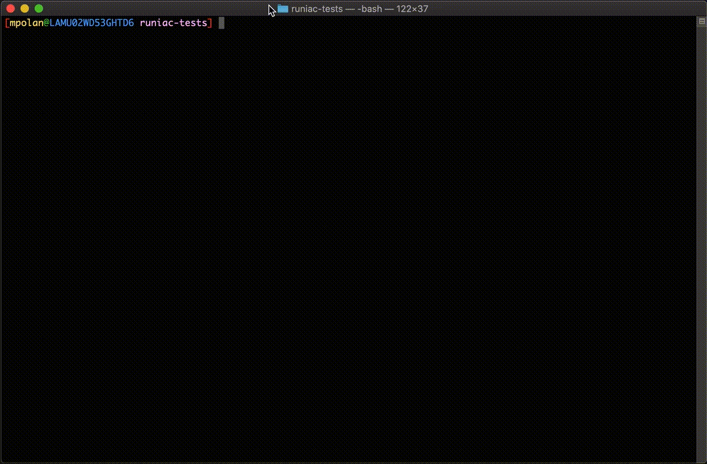

<!-- START doctoc generated TOC please keep comment here to allow auto update -->
<!-- DON'T EDIT THIS SECTION, INSTEAD RE-RUN doctoc TO UPDATE -->
**Table of Contents**  *generated with [DocToc](https://github.com/thlorenz/doctoc)*

- [runiac cli](#runiac-cli)
  - [Install Locally](#install-locally)

<!-- END doctoc generated TOC please keep comment here to allow auto update -->

# runiac cli

Easily create and run runiac projects!



## Quick Start

Run the `runiac new` command to initialize a new project directory. Simply answer the prompts as they appear,
and the CLI will automatically create the basic scaffolding for you.

Afterwards, create your infrastructure files according to the deployment tool you wish to use (ARM, Terraform). Once
you are ready, you can have runiac deploy your resources by running: `runiac deploy -a your_account_id -e your_environment`.

Be sure to check out the provided [examples](../../examples) for inspiration!

## Install Locally

```bash
$ go install
$ runiac help
```
